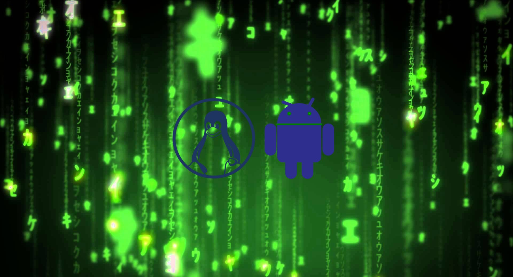
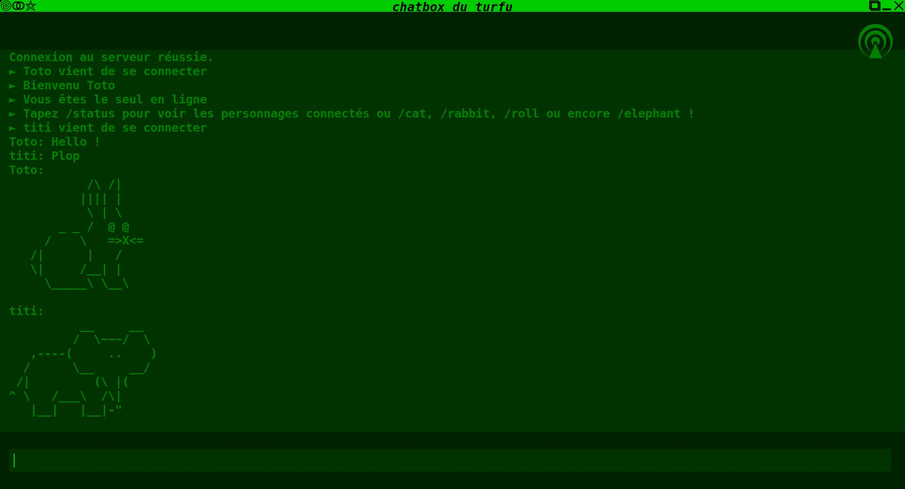
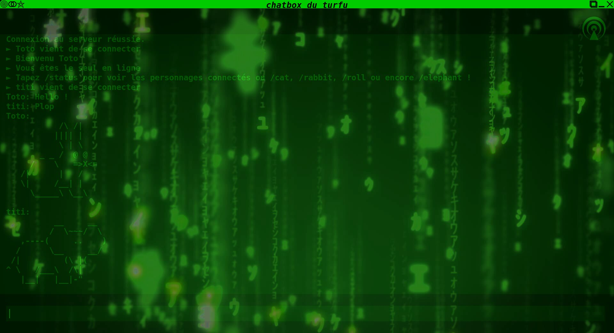
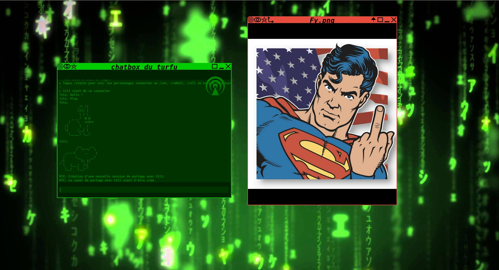
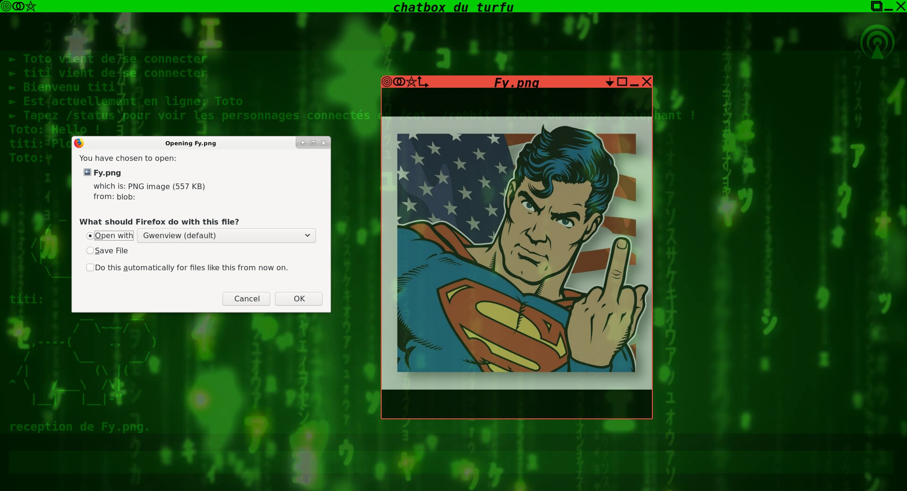
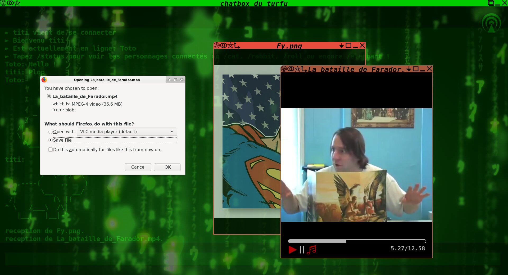

# Swirl

_P2P file sharing system_

### Home page

### You got a chat

### Modify transparency

### You can load and send medias

### The other man receave the medias

### You can also play and share videos, musics etc...

_run npm install && npm start_
